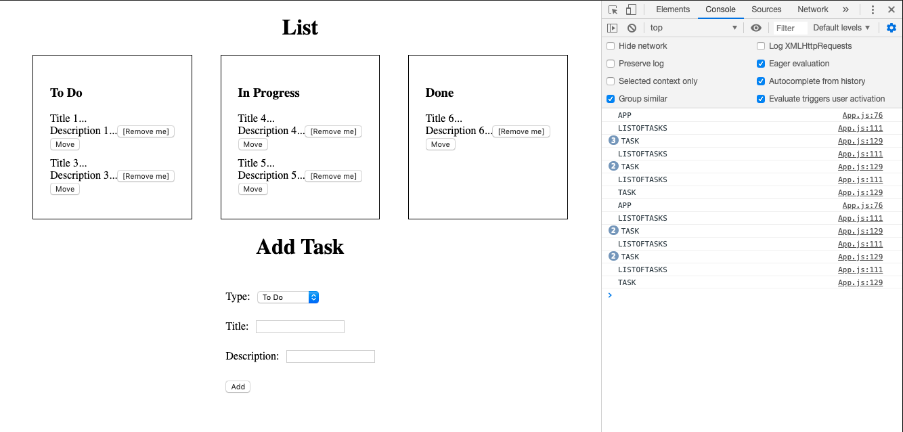
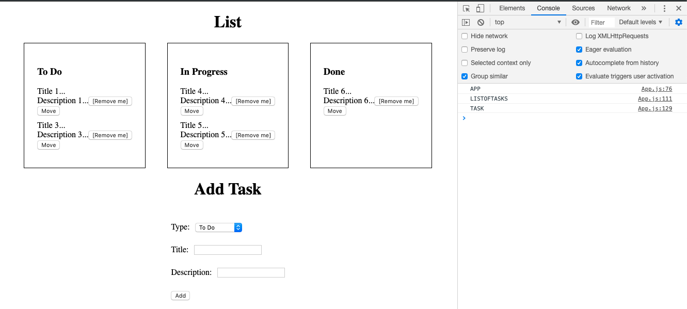

# Basic TODO board

[](https://greenkeeper.io/)
[](https://opensource.org/licenses/MIT)

This is an easy, basic and raw (minimum styling) example of **HOW to** create a `TODO board`

**NOTE:** This project was bootstrapped with [Create React App](https://github.com/facebook/create-react-app).

## Installation
```
yarn install
```

## Running the dev server
```
yarn start
```

## Description

...

Using `React.memo()` 

The first time we render our App we should see in our browser's `console` something like this:


However, what happens if we remove a task...?



You can verify that everything renders again, but that particular task. 

In this small application we will not suffer "performance issues", yet, we can improve its efficiency. 

So... Let's use `React.memo()`

> React.memo is a higher order component. It’s similar to React.PureComponent but for function components instead of classes.
If your function component renders the same result given the same props, you can wrap it in a call to React.memo for a performance boost in some cases by memoizing the result. This means that React will skip rendering the component, and reuse the last rendered result.
By default it will only shallowly compare complex objects in the props object. If you want control over the comparison, you can also provide a custom comparison function as the second argument. [React](https://reactjs.org/docs/react-api.html)

Once we render our app, if we remove a task...
* `App` should render once
* `ListOfTasks` should render once
* `Task` should render...
  *  If we remove the first one = length - 1. So if we have 8 tasks, after deleting `Task` will render 7 times.
  * If we remove the last one `Task` will not re render since this action does not affect other parts of the `DOM`
  * If we remove everything in between, example, task 3 in a list of 8 = length - task which in our example is 8 - 3 = 5. So, `Task` will render 5 times.

Example of removing task 2 using `React.memo()`


